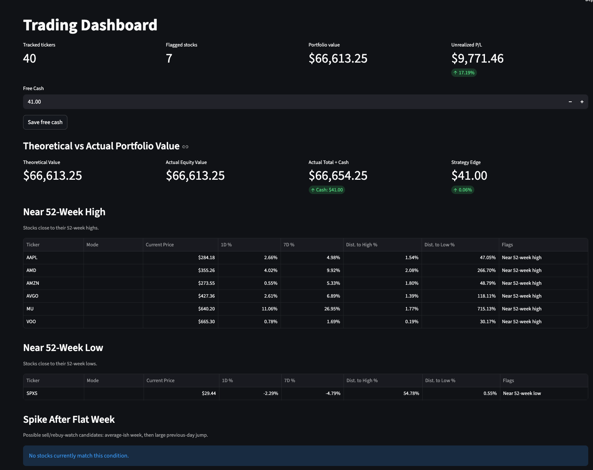

# Simple-Trading-Status-Dashboard

In this economy, stocks have been super volatile on a day-to-day basis. Even though overall annual growth used to fairly consistent, there will be days where the certain stocks spike up 10% and then come right back down the following day. This is a tool I built to be able to sell when that occurs and keep track of how much I sold, so I can buy it back in the next day or so. This is meant to run once a day and refetches data from yahoo finance (no api key required) on startup.

It is not meant to be an HFT engine, just a clean simple dashboard with reminders, as well as keeping track of how much your trading strategy has influenced your gains/losses versus the status quo.

You can add and remove stocks at will and set reminders that you sold or bought. I plan to add a few extra technical indicators that are low hanging fruit for trading. This is only a dashboard, you cannot perform trades.

